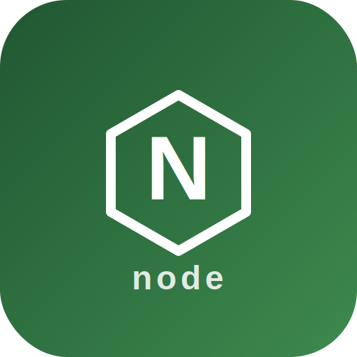

<p align="center">
  
</p>

# Node.js Runner for StartOS

> Run your own Node.js application directly on your StartOS server — with clearnet access, automatic `npm install`, and a live `nodeinfo()` placeholder out of the box.

Upload your app to [File Browser](https://github.com/Start9Labs/filebrowser-startos), point Node.js Runner at the folder, and restart. Your app is served immediately.

---

## Table of Contents

- [How It Works](#how-it-works)
- [Image and Container Runtime](#image-and-container-runtime)
- [Volume and Data Layout](#volume-and-data-layout)
- [Installation and First-Run Flow](#installation-and-first-run-flow)
- [Deploying Your App](#deploying-your-app)
- [Configuration Management](#configuration-management)
- [Network Access and Interfaces](#network-access-and-interfaces)
- [Actions (StartOS UI)](#actions-startos-ui)
- [Backups and Restore](#backups-and-restore)
- [Health Checks](#health-checks)
- [Dependencies](#dependencies)
- [Limitations](#limitations)
- [Contributing](#contributing)

---

## How It Works

On every service start, three steps run in sequence:

1. **copy-app** — copies your app from File Browser into the working volume (falls back to the built-in `nodeinfo()` placeholder if the folder is empty)
2. **install-deps** — runs `npm install` if a `package.json` is present
3. **primary** — starts your app via `entrypoint.sh`

Entry point priority: `$START_COMMAND` → `npm start` → `index.js` → `server.js` → `app.js`

Your app must listen on `process.env.PORT` (always `3000`).

When you update your code, re-upload to File Browser and restart the service — it will copy, install, and re-launch automatically.

---

## Image and Container Runtime

| Property      | Value                                  |
| ------------- | -------------------------------------- |
| Base images   | `node:20-alpine`, `node:22-alpine`, `node:24-alpine` |
| Architectures | x86\_64, aarch64                       |
| Command       | `sh /entrypoint.sh`                    |
| Internal port | `3000`                                 |

The Node.js version is selected via the **Set Node Version** action. Default is **Node 24**.

---

## Volume and Data Layout

| Volume        | Mount Point        | Purpose                                      |
| ------------- | ------------------ | -------------------------------------------- |
| `work`        | `/app/work`        | Working copy of your app + `node_modules`    |
| `startos`     | *(internal)*       | SDK state and `store.json`                   |
| `filebrowser` | `/mnt/filebrowser` | Read-only mount of File Browser data volume  |

`node_modules` is preserved across restarts inside `work` — `npm install` only installs what changed.

---

## Installation and First-Run Flow

1. Install **File Browser** (required dependency)
2. Install **Node.js Runner** — the `nodeinfo()` placeholder starts immediately
3. Use the **Set App Path** action to point the runner at your app folder

---

## Deploying Your App

1. Upload your Node.js app to File Browser (e.g. into a folder called `my-app`)
2. Run the **Set App Path** action and enter `my-app`
3. Restart the service

Your app must listen on `process.env.PORT`:

```js
const port = process.env.PORT || 3000
app.listen(port)
```

---

## Configuration Management

| Setting        | Where        | Default        |
| -------------- | ------------ | -------------- |
| `appPath`      | `store.json` | `''` (FB root) |
| `nodeVersion`  | `store.json` | `'24'`         |
| `startCommand` | `store.json` | `''`           |
| `envVars`      | `store.json` | `[]`           |

All settings are read reactively — changing any of them via an action restarts the service automatically.

---

## Network Access and Interfaces

| Interface | Port | Protocol | Purpose          |
| --------- | ---- | -------- | ---------------- |
| Web UI    | 3000 | HTTP     | Your Node.js app |

**Access methods:**

- LAN: `<hostname>.local`
- Tor: `.onion` address
- Clearnet: custom public domain (requires gateway + Let's Encrypt)

StartOS handles all TLS termination. Your app always receives plain HTTP.

---

## Actions (StartOS UI)

| Action            | Description                                              |
| ----------------- | -------------------------------------------------------- |
| Set App Path      | Set which File Browser folder contains your app          |
| Set Node Version  | Choose Node.js runtime version (20, 22, or 24)           |
| Set Start Command | Override the launch command (e.g. `node dist/server.js`) |
| Set Env Vars      | Inject custom environment variables into your app        |

All actions trigger a service restart.

---

## Backups and Restore

**Included in backup:** `work` volume (your running app + `node_modules`)

**Restore behavior:** Volume is fully restored before the service starts. On next start the copy-app step re-syncs from File Browser.

---

## Health Checks

| Check       | Method                | Success          | Failure                              |
| ----------- | --------------------- | ---------------- | ------------------------------------ |
| Node.js App | Port listening (3000) | "App is running" | "App is not ready — check logs for details" |

Grace period: 5 seconds.

---

## Dependencies

| Package      | Kind   | Min version  | Purpose                  |
| ------------ | ------ | ------------ | ------------------------ |
| File Browser | exists | `>=2.62.2:0` | Source of your app files |

---

## Limitations

1. **Manual restart required on deploy** — upload new code to File Browser, then restart the service
2. **No process isolation** — your app runs inside a container; avoid untrusted code
3. **Single app per instance** — one Node.js process per Node.js Runner install

---

## Contributing

See [CONTRIBUTING.md](CONTRIBUTING.md) for build instructions, development workflow, and notes on the podman/docker shim.

---

## Quick Reference for AI Consumers

```yaml
package_id: node-runner
images:
  node-runner-20: node:20-alpine
  node-runner-22: node:22-alpine
  node-runner-24: node:24-alpine
architectures: [x86_64, aarch64]
volumes:
  work: /app/work        # running app + node_modules (persistent)
  startos: internal      # SDK state and store.json
  filebrowser: /mnt/filebrowser  # read-only dependency mount
ports:
  ui: 3000
dependencies:
  filebrowser: { kind: exists, minVersion: ">=2.62.2:0" }
startos_managed_env_vars:
  PORT: "3000"
  NODE_ENV: production
  START_COMMAND: (optional, from store)
  <user-defined>: (from envVars store array)
actions:
  set-app-path: configure which File Browser folder contains the app (triggers restart)
  set-node-version: choose Node.js runtime version 20/22/24 (triggers restart)
  set-start-command: override launch command (triggers restart)
  set-env-vars: inject custom env vars (triggers restart)
oneshots:
  copy-app: cleans /app/work, copies from FileBrowser or falls back to default placeholder
  install-deps: runs npm install if package.json present
entrypoint_priority: [START_COMMAND, npm start, index.js, server.js, app.js]
default_placeholder: nodeinfo() page showing Node.js runtime info and all env vars
```
